# Test Domain
 This should be a description of the domain.

## Primary label of a term
_Also known as: Primary label of a term, Another label for the term_  

 This is an informal description of the term [Primary label of a term].

```plantuml
@startuml
hide empty members
hide circle
set namespaceSeparator ::
skinparam class {
  BackgroundColor GhostWhite
}
skinparam package {
  BorderColor Grey
}
package Test_Domain #AliceBlue {}
class Test_Domain::term_632395035 as "Primary label of a term"[[plantmps://DEFAULT/i:10000001/6737965024083660734 Primary label of a term]] #PapayaWhip
{
  <color:grey><size:10>Another label for the term</size></color>
}
@enduml
```

## B
_Also known as: B_  

 foo asdf asdf asdf asdf asdf [B] fasdfas fas dfa sdfa Test Domain asdf asdf asdf asdf asdfafdasdf asdf.

```plantuml
@startuml
hide empty members
hide circle
set namespaceSeparator ::
skinparam class {
  BackgroundColor GhostWhite
}
skinparam package {
  BorderColor Grey
}
package Test_Domain #AliceBlue {}
class Test_Domain::term_171346982 as "B"[[plantmps://DEFAULT/i:10000001/3889923412178186116 B]] #PapayaWhip
{
}
@enduml
```

## C
_Also known as: C, D, F_  

 fasdf asdf asdf asdf asdf asdf asdf asdf. asdfasdf asdfasdf asdfasdf asdfasdf. ddfadsfadfs asdfasdf adsfasdf. By submitting this form, I agree that my email address, name, and location may be used by JetBrains s.r.o. ("JetBrains") for the purposes outlined above. I agree that JetBrains may process said data using hjhj adsas fasdf jkkjk.

```plantuml
@startuml
hide empty members
hide circle
set namespaceSeparator ::
skinparam class {
  BackgroundColor GhostWhite
}
skinparam package {
  BorderColor Grey
}
package Test_Domain #AliceBlue {}
class Test_Domain::term_2088808279 as "C"[[plantmps://DEFAULT/i:10000001/3889923412178186531 C]] #PapayaWhip
{
  <color:grey><size:10>D</size></color>
  <color:grey><size:10>F</size></color>
}
@enduml
```

## Foo
_Also known as: Foo_  

 This is normal text you know asdf adsf [C] Test Domains [B]asdfasasdfasdf.

```plantuml
@startuml
hide empty members
hide circle
set namespaceSeparator ::
skinparam class {
  BackgroundColor GhostWhite
}
skinparam package {
  BorderColor Grey
}
package Test_Domain #AliceBlue {}
class Test_Domain::term_1164960536 as "Foo"[[plantmps://DEFAULT/i:10000001/3889923412178451721 Foo]] #PapayaWhip
{
}
class Test_Domain::term_2088808279 as "C"[[plantmps://DEFAULT/i:10000001/3889923412178186531 C]] 
{
  <color:grey><size:10>D</size></color>
  <color:grey><size:10>F</size></color>
}
class Test_Domain::term_632395035 as "Primary label of a term"[[plantmps://DEFAULT/i:10000001/6737965024083660734 Primary label of a term]] 
{
  <color:grey><size:10>Another label for the term</size></color>
}
class Test_Domain::term_171346982 as "B"[[plantmps://DEFAULT/i:10000001/3889923412178186116 B]] 
{
}
Test_Domain::term_1164960536 <|-- Test_Domain::term_171346982
Test_Domain::term_2088808279 -- Test_Domain::term_1164960536: ""
Test_Domain::term_2088808279 <|-- Test_Domain::term_1164960536
Test_Domain::term_632395035 -- Test_Domain::term_1164960536: ""
Test_Domain::term_2088808279 o-- Test_Domain::term_1164960536: ""
Test_Domain::term_1164960536"1..6" o-- "2..100"Test_Domain::term_171346982: "> blah adsf asdf\nasdf asdf\nasdf asdf"
Test_Domain::term_1164960536 <|-- Test_Domain::term_632395035
Test_Domain::term_171346982 <|-- Test_Domain::term_1164960536
@enduml
```

## Bar
_Also known as: Bar_  

 asdf asdf asdf asdf asdf asdf [Bar]

```plantuml
@startuml
hide empty members
hide circle
set namespaceSeparator ::
skinparam class {
  BackgroundColor GhostWhite
}
skinparam package {
  BorderColor Grey
}
package Test_Domain #AliceBlue {}
class Test_Domain::term_25732194 as "Bar"[[plantmps://DEFAULT/i:10000001/3889923412178558491 Bar]] #PapayaWhip
{
}
class Test_Domain::term_2088808279 as "C"[[plantmps://DEFAULT/i:10000001/3889923412178186531 C]] 
{
  <color:grey><size:10>D</size></color>
  <color:grey><size:10>F</size></color>
}
class Foo::term_762655738 as "Bar"[[plantmps://DEFAULT/i:10000001/3889923412180558461 Bar]] 
{
}
class Test_Domain::term_1164960536 as "Foo"[[plantmps://DEFAULT/i:10000001/3889923412178451721 Foo]] 
{
}
Test_Domain::term_1164960536 <|-- Test_Domain::term_25732194
Foo::term_762655738 -- Test_Domain::term_25732194: ""
Test_Domain::term_2088808279 <|-- Test_Domain::term_25732194
@enduml
```

